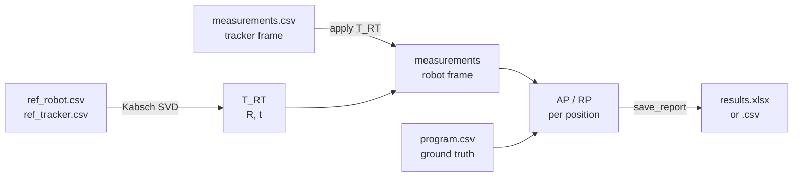

# robot-accuracy

Mini-library and CLI for evaluating robot positioning accuracy and repeatability from tracker measurements.

Given a set of **reference points** measured by both a robot and a tracker, `robot-accuracy` estimates the rigid transformation **T_RT** (tracker → robot base frame) and computes the standard **AP** and **RP** metrics per ISO 9283.

## Features

- Rigid transform estimation `p_R = R · p_T + t` via **Kabsch algorithm** (SVD) with reflection fix (`det(R) = +1`)
- Transformation of tracker measurements into the robot base frame
- **AP** (Accuracy): distance between the mean measured point and the reference (ground-truth) position
- **RP** (Repeatability): `L̄ + 3σ`, where `L̄` is the mean distance to the centroid and `σ` is the standard deviation
- Report export to **XLSX** (two sheets) or a pair of **CSV** files

## Quick Example

```bash
pip install -e robot_accuracy[excel]

python -m robot_accuracy \
  --ref-robot  data/ref_robot.csv \
  --ref-tracker data/ref_tracker.csv \
  --prog       data/program.csv \
  --meas       data/measurements.csv \
  --cycles     30 \
  --out        results.xlsx
```

## Pipeline Overview


