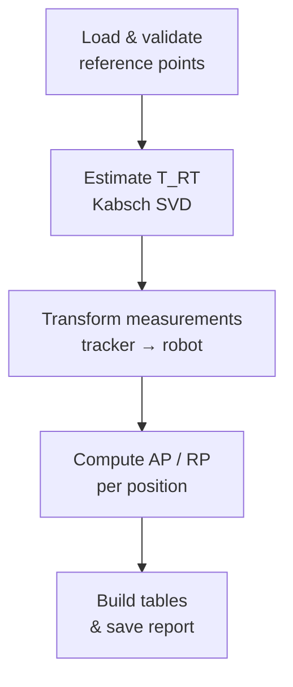

# Processing Pipeline

The library executes a linear pipeline of four stages.

---

## Stage 1 — Load & Validate

`io.py` loads the four input files and performs structural validation:

- Columns presence and types
- Matching name order between `ref_robot` and `ref_tracker`
- Minimum 4 non-coplanar reference points
- Exact cycle count per position

Raises `DataFormatError` (subclass of `ValueError`) on any structural issue.

---

## Stage 2 — Estimate T_RT (Kabsch Algorithm)

`transform.estimate_rt_svd(P_R, P_T)` finds the rotation `R` and translation `t` that minimises:

$$\sum_{i=1}^{N} \| p_{R,i} - (R \cdot p_{T,i} + t) \|^2$$

**Steps:**

1. Compute centroids and centre both point sets.
2. Build cross-covariance matrix `H = Xᵀ Y` (3×3).
3. Decompose `H = U S Vᵀ` via SVD.
4. Set `R = Vᵀᵀ Uᵀ`.
5. Fix reflection: if `det(R) < 0`, flip the sign of the last row of `Vᵀ`.
6. Compute translation `t = mean(P_R) − R · mean(P_T)`.

Returns a `TransformRT` dataclass plus per-point residuals, max residual, and RMS residual.

!!! warning "Residual threshold"
    If `--max-resid` is set and the maximum residual exceeds the threshold, the pipeline raises `ValueError` and aborts. This guards against incorrect point correspondence or a degenerate configuration.

---

## Stage 3 — Transform Measurements

All tracker measurements are projected into the robot base frame:

$$x_R = R \cdot x_T + t$$

This is a vectorised call: `T.apply(meas_tracker[pos])` returns an `(M, 3)` array.

---

## Stage 4 — Compute AP / RP

For each program position `Pᵢ`:

| Quantity | Formula |
|---|---|
| Centroid | `c = mean(measurements_R)` |
| AP | `‖c − real_point‖₂` |
| Distances to centroid | `dⱼ = ‖xⱼ − c‖₂` |
| `L̄` | `mean(dⱼ)` |
| `σ` | `std(dⱼ, ddof=1)` |
| RP | `L̄ + 3σ` |

The `RP` formula follows **ISO 9283** (pose repeatability for industrial robots).
